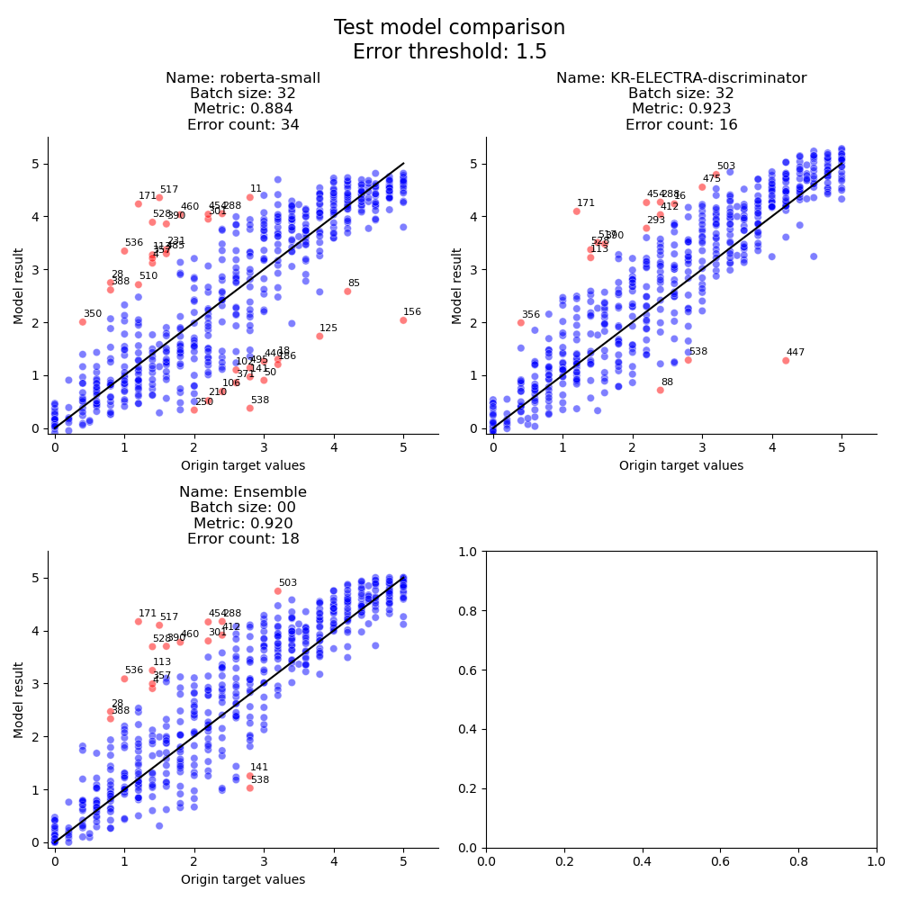

# NLP Competition level1: STS

## 대회 소개

### STS 란?

STS (Semantic Textual Similarity) 는 자연어 처리 분야에서 두 개의 문장 또는 문장 조각 사이의 의미적 유사성을 측정하는 작업입니다. 이 작업의 주요 목적은 두 개의 입력 텍스트가 얼마나 유사한지 점수로 나타내는 것입니다. 주어진 데이터셋 에서는 0점 에서 5점 사이의 실수값으로 두 문장이 얼마나 비슷한지를 나타내었으며, 높을수록 더 유사한 의미를 갖습니다.

### 대회 정보

| 항목     | 내용                                                         |
| -------- | ------------------------------------------------------------ |
| 주최     | Naver Boostcamp AI Tech                                      |
| 일정     | 2023년 12월 13일 ~ 2023년 12월 21일                          |
| 평가방식 | STS 데이터셋을 활용해 두 문장의 유사도를 측정하는 AI모델을 구축하여, 비공개 test 데이터셋 에대해 가장 높은 pearson 값을 도달한 팀이 우승 |

## 팀 정보

### 팀 이름

**I들의 모임** $\leftarrow$ MBTI I 로만 구성된 남자들의 모임

### 팀원 소개

| 이름                                                         | 역할                                                         |
| ------------------------------------------------------------ | ------------------------------------------------------------ |
| 서동해 [Github](https://github.com/DonghaeSuh)               | Baseline 코드 작성, 데이터 분석 및 시각화, 데이터 전처리 실험, 데이터 증강 실험, Loss 실험, 결합 모델 실험 (Cosine similarity), 앙상블 실험, 예측결과 시각화 및 분석 |
| 황재훈 [Github](https://github.com/iloveonsen?tab=repositories) | 모델 실험, Baseline 코드 작성, refactoring 및 기능추가, 데이터 증강 실험, Loss 실험, Regularization 적용, 앙상블, 예측결과 시각화 및 분석 |
| 이상경 [Github]()                                            |                                                              |
| 김재현 [Github]()                                            |                                                              |
| 송민환 [Github]()                                            |                                                              |
| 조병률 [Github]()                                            |                                                              |

## 프로젝트 설명

### 개발 환경

| 항목          | 내용                                                         |
| ------------- | ------------------------------------------------------------ |
| Hardware      | 1. GPU instance: Intel(R) Xeon(R) CPU + 88GB RAM + Tesla V100 32GB VRAM <br />2. PC: RTX4060ti, RTX4080 |
| OS            | 1. Ubuntu 20.04.6 LTS<br />2. Windows 11                     |
| Software      | Python 3.10.x , CUDA 11.4+                                   |
| Collaboration | Github (코드), Notion (실험 결과), Zoom (회의)               |

### Baseline

train/dev/test 데이터셋 및 Huggingface 의 pre-trained 된 모델을 불러와서 fine-tuning 할수 있는 기본 코드가 제공되며 규칙은 다음과 같습니다.

1. 주어진 데이터셋 이외에 외부 데이터셋 사용금지
2. 모든 pre-trained 모델 사용 허용
3. Train/Dev 데이터셋에 한해 Augmentation 가능하며, 주어진 GPU instance 에서 돌아갈 수 있는 모델은 사용가능, but 외부 LLM API 사용 제한

### 주요 실험

#### 1. Pre-trained model selection

|                             모델                             |                             목록                             |
| :----------------------------------------------------------: | :----------------------------------------------------------: |
| [**snunlp/KR-ELECTRA-discriminator**](https://huggingface.co/snunlp/KR-ELECTRA-discriminator) | [klue/roberta-large](https://huggingface.co/klue/roberta-large) |
| [xlm-roberta-large](https://huggingface.co/xlm-roberta-large) | [beomi/KcELECTRA-base](https://huggingface.co/beomi/KcELECTRA-base) |
| [snunlp/KR-SBERT-V40K-klueNLI-augSTS](https://huggingface.co/snunlp/KR-SBERT-V40K-klueNLI-augSTS) | [monologg/koelectra-base-discriminator](https://huggingface.co/monologg/koelectra-base-discriminator) |
| [kakaobank/kf-deberta-base](https://huggingface.co/kakaobank/kf-deberta-base) | [BM-K/KoSimCSE-roberta-multitask](https://huggingface.co/BM-K/KoSimCSE-roberta-multitask) |

snunlp/KR-ELECTRA-discriminator

>  단일 모델로는 가장 성능이 잘 나온 모델로써, 다양한 실험의 기준 모델로 활용됨

#### 2. Kfold cross-validation

- 거의 모든 모델에서 과적합이 너무 심하게 일어나는 관계로 폐기 (e.g. validation pearson 0.95 $\rightarrow$ submission pearson 0.90)

#### 3. Data manipulation

##### Special token 추가

- 데이터셋에 주어진 `source` 열 에서 추출하여 토큰화
- 문장별로 전체 5개의 토큰을 추가 (`petition`, `nsmc`, `slack`, `sampled`, `rtt`)
- 대부분의 모델에서 소량의 성능향상을 확인하였으며, 이후 모든 모델에 적용

##### ~~특수문자 간소화 및 제거~~

- `~~~~~` 나 `!!!!!` 등 특수문자가 여러번 지속되어 나타나는 경우, 특정 숫자까지 줄이거나  (`!!!!!` $\rightarrow$ `!!`) 삭제
- 성능이 오히려 데이터가 오히려 정보를 잃었다고 판단 $\rightarrow$ 폐기

##### ~~예측 결과를 0~5 범위내로 들어오도록 강제 scaling~~

- 예측 label 이 5보다 크거나 0보다 작은 경우, 5또는 0으로 맞춰줌
- Scaling 을 하지 않았을때의 결과가 제출 pearson, validation pearson 점수 둘다 더 높았음

#### 4. Data augmentation

##### ~~Sentence swap~~

- 모델에 input 을 넣을때 문장1과 문장2를 하나의 시퀀스로 concat 해서 넣기 때문에, 모델이 순서 정보를 그대로 학습할 가능성이 존재
- concat 할때 문장2를 처음에 오도록 하여 기존의 순서를 swap
-  기존 데이터 + swap 한 데이터를 붙여서 학습하되 swap 데이터 비율을 조정 (전체, label 0 제외, 10% 샘플링 등)
- 기존 데이터만 사용했을때에 비해 특정 loss (train, valid 포함) 수준까지 더 빠르게 수렴함
  - `snunlp/KR-ELECTRA-discriminator`, `lr=1e-5`, `batch_size=32`, `loss_fn=L1Loss()` 일때, `val_loss` 가 0.15 까지 수렴하는데 걸리는 시간:
  - 기존 데이터 5 epoch 이상 $\rightarrow$ swap 데이터 3 epoch 이내
- 그러나, 특정 step 에서 수렴 한후 loss 가 더 떨어지지 않고 오히려 divergence 가 발생함으로써, 빠르게 과적합되는 경우가 지속적으로 관찰됨

##### ~~Back-translation~~

- 각 문장을 변역기 API 를 사용하여 다른나라 언어 (영어/일본어) 로 번역후 다시 한국어로 되돌리는 방식
- 같은 의미이지만 다양한 표현을 얻을수 있으므로 데이터를 늘리기 적합하다고 판단함
- API 호출에 다양한 오류 발생 및 API 사용 허가에 대한 불확실성으로 배제

#### 5. Generalization

##### SmoothL1Loss

- 기존 baseline 에 있었던 `L1Loss` 이외에 `MSELoss`, `HuberLoss`, `SmoothL1Loss` 에 대해 학습, 여러개의 loss 를 평균내는 방식또한 학습
- 다른 조건이 동일한 경우,  `SmoothL1Loss` 를 단독으로 썼을때 가장 `val_loss` 값이 낮아지는 것으로 확인

##### Dropout

- 기존 `AutoModelForSequenceClassification` 대신에, `AutoModel` 에다 dropout 을 적용한 regression head 를 붙여서 학습
- `val_pearson` 값은 기존 classifier 모델에 비해 약간 떨어지지만,  제출점수는 미미하게 상승함 (0.001~0.002)

##### ~~RDrop~~

- 모델에 dropout 레이어가 포함된경우, 매 iteration 마다 dropout 되는 노드들이 달라도, 일관된 결과를 유지할수 있도록 기존 loss 에 penalty 를 부여한 것
- 매 step 마다 forward pass 를 두번 거쳐야 하므로 시간및 step 이 두배 더 필요
- 제출 결과 예측시, 기존에 label 5 이상으로 예측되던 분포가 label 4 를 기준으로 몰려드는 모습을 보여줌
- 사용하지 않았을때 대비 validation 및 제출 score 에서 유의미한 상승을 보이지 못해서 배제 했으나,  이후 private score 에서 약 0.009 가량 점수가 상승하는 모습을 보여줌

##### LR Scheduler

- 처음에는 test 지표에 따라 dynamic 하게 lr 을 변경하고자 `ReduceLROnPlateau` 를 사용했으나, 결과의 일관성을 얻기 복잡해서 배제
- 완만한 convergence 를 만들어내기 위해 첫 3 epoch 동안 warm-up (`LambdaLR`) 하고 그 이후로는 2 epoch 마다 lr 을 10%씩 감소시키는 `StepLR` 을 적용
- 성능에 유의미한 향상을 가져다 주지는 않았지만, loss 그래프가 연착륙하는 모습을 확인

##### Early Stopping

- 기존 `val_pearson` 기준으로 종료시키던 부분을 custom 하여, `val_loss` 또는 `val_pearson` 둘중에 하나의 지표라도 3 epoch 이내에 좋아지지 못하면 학습을 종료하도록 변경

##### Checkpoint

- 기존 `val_pearson` 이 상승할때 checkpoint 를 저장하는 방식을 custom 하여, `val_loss` 와 `val_pearson` 지표가 둘다 상승하는 시점에만 저장하도록 변경

#### 6. Ensemble

> 다양한 모델, 하이퍼 파라미터, 앙상블 비율에 따라서 진행했으며, score 갱신은 대부분 앙상블 모델로 이루어짐

##### 모델 목록

| 이름                                  | learning_rate | batch_size | val_pearson | submission |
| ------------------------------------- | ------------- | ---------- | ----------- | ---------- |
| snunlp/KR-ELECTRA-discriminator       | 1e-5          | 32         |             |            |
| xlm-roberta-large                     | 1e-5          | 8          |             |            |
| monologg/koelectra-base-discriminator | 1e-5          | 32         |             |            |
| klue/roberta-large                    | 1e-5          | 8          |             |            |

**최종결과:** *public:* 0.9329 (4th) $\rightarrow$ *private:* 0.9386 (5th)

#### 7. Further studies

> 더 해볼수 있었던 실험 목록

1. 데이터를 작게 샘플링해서 다양한 가설을 미리 검증하기 (작은 데이터에서 증명되지 않는 가정은 전체 데이터를 가지고 해도 성립되지 않는다.)

2. 동일한 세팅에서 최소 5번 정도는 Seed 를 바꿔서 실행해 보아햐 한다.

3. **데이터가 충분히 많을 경우** hierarchical classification 을 시도해볼만 하다.


## Manual

> 특별히 코드를 건드리지 않고 바로바로 실험할수 있게 하는것을 목표로 하였습니다.

### Directory Listing

```bash
level1-semantictextsimilarity-nlp-02
 ┣ .gitignore
 ┣ config.json
 ┣ data
 ┃ ┣ train.csv
 ┃ ┣ dev.csv
 ┃ ┣ test.csv
 ┃ ┗ sample_submission.csv
 ┣ saves
 ┃ ┣ snunlp
 ┃ ┃ ┗ KR-ELECTRA-discriminator_
 ┃ ┗ klue
 ┃   ┗ roberta-large_
 ┣ ensembles
 ┃ ┣ snunlp
 ┃ ┃ ┗ KR-ELECTRA-discriminator_
 ┃ ┗ klue
 ┃   ┗ roberta-large_
 ┣ test_outputs
 ┃ ┣ snunlp
 ┃ ┃ ┗ KR-ELECTRA-discriminator_
 ┃ ┣ klue
 ┃ ┃ ┗ roberta-large_
 ┃ ┗ ensemble
 ┃   ┗ 0_KR-ELECTRA-discriminator_1_roberta-large_... 
 ┣ outputs
 ┃ ┣ snunlp
 ┃ ┃ ┗ KR-ELECTRA-discriminator_
 ┃ ┣ klue
 ┃ ┃ ┗ roberta-large_
 ┃ ┗ ensemble
 ┃   ┗ 0_KR-ELECTRA-discriminator_1_roberta-large_... 
 ┣ callbacks.py
 ┣ data_module.py
 ┣ models.py
 ┣ utils.py
 ┣ run.py
 ┗ README.md
```

- `config.json` : 모델 및 하이퍼파라미터, 데이터 및 저장 경로 설정
- `data` : 사용 데이터 저장
- `saves` : 학습한 모델 및 checkpoint 저장
- `ensembles` : 앙상블할 모델 checkpoint 모음
- `test_outputs` : test 데이터 (`dev.csv`) 를 기준으로 inference 한 결과를 저장 (산점도 등에 활용)
- `outputs` : submission 데이터 (`test.csv`) 를 기준으로 inference 한 결과를 저장
- `callbacks` : custom callback 모음
- `data_module` : 데이터셋 및 데이터 모듈 모음
- `models.py` : 모델 모음
- `utils.py` : helper 함수 모음
- `run.py` : 실행 파일 (`train.py` 와 `inference.py` 단일화)

### Configuration

`config.json` 파일에서 hyper-parameter 를 수정해주세요.

```json
{
    "seed": 1784,
    "inference": false,
    "best": false,
    "test": false,
    "wandb_project_name": "<your-wandb-project-name>",
    "wandb_username": "<your-wandb-user-name>",
    "model_name": ["klue/roberta-base", "klue/roberta-small"],
    "model_detail": ["v", "v"],
    "batch_size": [16, 32, 64],
    "max_epoch": [5, 10, 15],
    "shuffle": true,
    "learning_rate": [1e-5, 5e-5],
    "kfold": 5,
    "data_dir": "./data",
    "test_output_dir": "./test_outputs",
    "output_dir": "./outputs",
    "model_dir": "./saves",
    "train_path": "train.csv",
    "dev_path": "dev.csv",
    "test_path": "dev.csv",
    "predict_path": "test.csv"
}
```
- `data` 폴더 내부에 `train.csv`, `dev.csv`, `test.csv`, `sample_submission.csv` 를 넣어놔주세요.
- `model_name` 의 list 에 원하는 모델을 추가가능합니다.
- `model_detail` 의 경우 `model_name` 와 같은 인덱스에 대응해야 합니다.
- `batch_size`, `max_epoch`, `learning_rate` 에 명시된 각 원소들을 조합하여 모든 combination 에 대해 모델을 실행합니다.
- `kfold` 값을 1보다 크게 설정한 경우 cross-validation 으로 학습합니다.

### Training

> ```
> python run.py
> ```

모델 저장은 `./saves/` 내부에 저장됩니다.
- 저장 path 는 `./saves/klue/roberta-small_v03_16_1_1e-05_000_00583_0.862_20231214_221830.ckpt`형식 이며
- 이름 `roberta-small_v03_16_1_1e-05_000_00583_0.862_20231214_221830` 은
  - `roberta-small`: 모델명
  - `v03`: 버전
    - 버전은 매 combination 마다 자동으로 update 됩니다.
  - `16`: batch_size
  - `1`: max_epoch
  - `1e-05`: learning_rate
  - `000`: current_epoch
  - `00583`: current_step
  - `0.862`: pearson value
  - `20231214_221830`: current_date _ current_time

### Inference

> ```
> python run.py --inference {--best} {--test}
> ```

- `--best` 옵션 설정하신 경우 가장 성능이 좋았던 모델을 기준으로 inference
- 하지 않을경우, 가장 최근의 모델을 기준으로 inference 합니다.
- `--test` 옵션을 설정할 경우 `test_path` 에 있는 dataset 을 기준으로 예측값을 측정하여 하나의 csv 파일로 concat 합니다.
  - 출력의 경우 `test_output_dir` 내부에 모델 author (snunlp, klue, etc.) 별로 폴더를 만들어 저장합니다.
  - 파일명은 위의 모델 이름에서 person value 값을 예측값으로 부터 새로 계산하고, 현재 시간을 반영한 상태로 저장됩니다.


결과는 `./outputs/` 에 저장됩니다.
- `data` 폴더 내부의 `sample_submission.py` 에서 input 을 읽어오며,
- 형태는 `{위의 모델 체크포인트 이름}.csv` 의 형태로 저장됩니다.

### Ensemble

> ```
> python --inference --ensemble {--test}
> ```

앙상블을 하기위해서는 미리 `./ensembles` 디렉토리를 준비해주셔야합니다.
- 디렉토리를 만드신후 앙상블 하고 싶으신 모델 체크포인트를 직접 모델제작자 (snunlp, klue etc.) 폴더 내에 복사해 주세요.

폴더 구조
- ensembles
  - 모델제작자
    - 모델이름.ckpt


방식
- `--test` 일 경우, test dataset 을 불러와서 `ensembles` 내에 저장된 각각의 모델을 불러와서 예측값을 계산합니다.
  - 모델별 예측결과를 concat후 softmax 를 거쳐 가중합을 계산합니다.
  - test dataset 에 GT 와 각 모델 별 + 앙상블 결과를 각각 비교하여 evaluation metric 값을 계산하고, 산점도를 출력합니다.
    - 산점도는 `./plots` 폴더가 자동 생성되며 내부에 `plot_models_{생성일자}_{생성시간}.png` 형태로 저장됩니다.
- 예시 plot
  
  - 계산된 결과는 `./test_output` 에 `ensemble` 폴더 내부에 저장 됩니다. (기존의 모델 저자 폴더 e.g. `snunlp`, `klue` etc.)
  
- `--test` 를 하지 않으실경우 기존 inference 와 동일하게 prediction data 를 읽어와서 각 row 에맞는 예측값을 계산하여, concat 한 후, `./output` 의 `ensemble` 폴더 내부에  `csv` 형태로 저장합니다.

**EOF** 